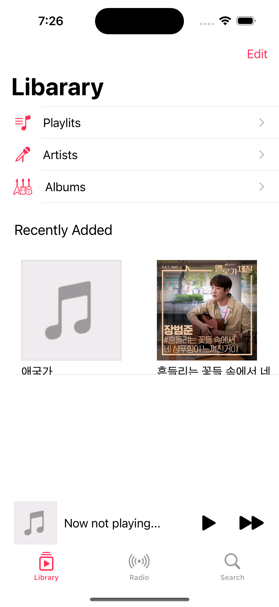
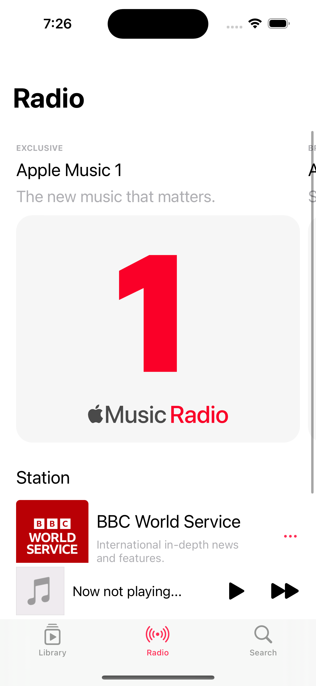

#  Apple Music Clone

    

        
        
Library

    

    

        
        
Radio

    

    

        
        
Search

    

 TODO
- [ ] volume 관련 Observer 붙이기
- [ ] 음악 파일 불러다 재생하기
- [ ] 음악 재생되면 album art 사이즈 변경

*** 아쉬운 점
1. 음악 실행, 트랜지션 등 구현하지 못 함
2. 첫 클론으로, 전체적인 완성도 면에서 아쉬움

